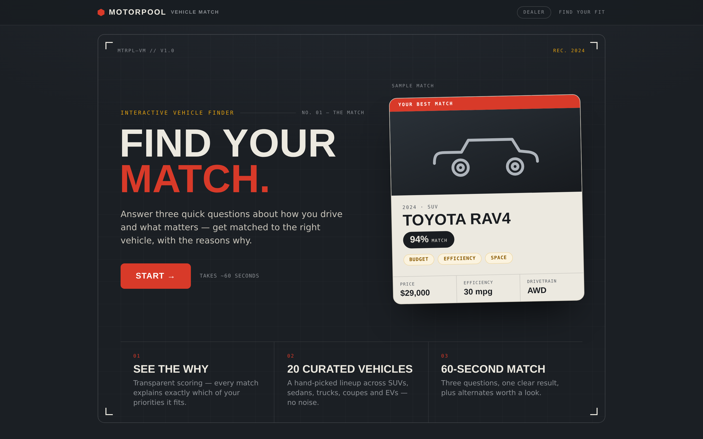
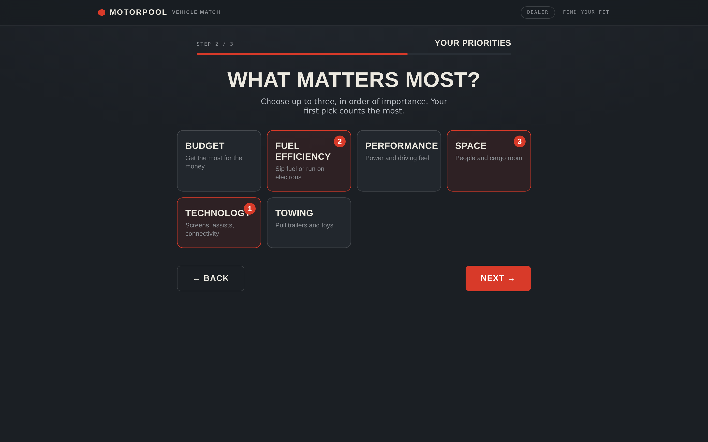
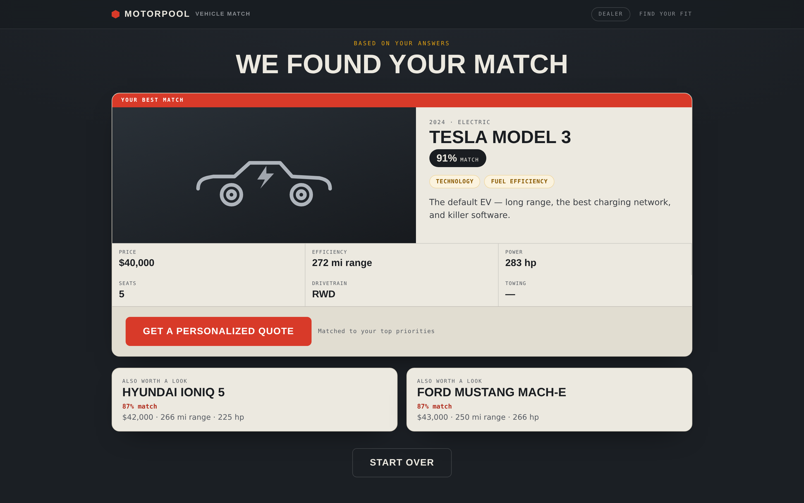
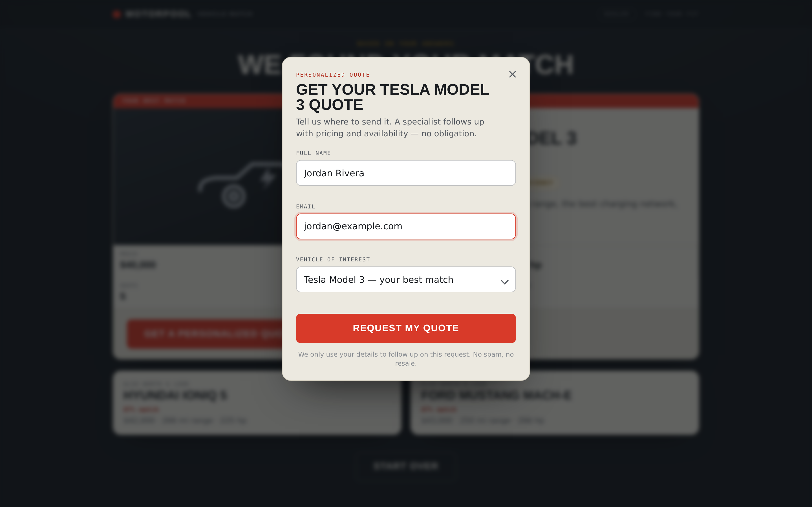
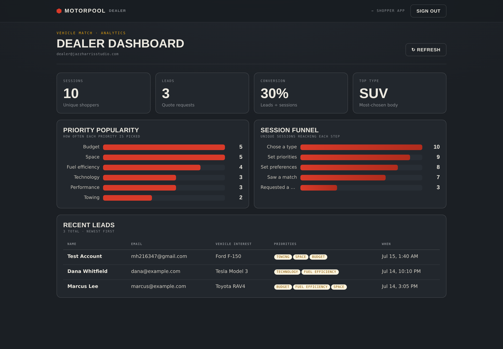

# Vehicle Match — Interactive Vehicle Recommendation Platform

**A web application that simplifies vehicle discovery by matching customers with the
right vehicle based on their preferences, lifestyle, and budget — then turns that
moment of clarity into a qualified sales lead.**

Built by **Jazz Harris Studio** under the *Motorpool* brand.

🔗 **Live:** https://jazz-h.github.io/vehicle-match/
&nbsp;·&nbsp; 🖥️ **Dealer dashboard:** `/dashboard.html` (gated)

---

## The problem

Car shoppers face **choice overload**. A modern lineup spans dozens of models across
body types, powertrains, and price bands, and the tools meant to help — spec sheets,
filter-heavy inventory search, comparison tables — assume the shopper already knows
what they want. Most don't. They know how they *live*: a growing family, a long
commute, weekend towing, a tight budget.

For the dealer, that mismatch is expensive. Undirected browsers bounce, and the ones
who do reach out arrive **cold** — no context on what matters to them, so every
conversation starts from zero.

## The approach

Instead of another filter grid, Vehicle Match runs a **guided, three-question
conversation** and returns a single confident recommendation — with the *reasons why*.

1. **Type** — what body style are you shopping for? (or "no preference")
2. **Priorities** — pick up to three things that matter most, in order.
3. **Preferences** — a few hard limits: budget, seating, drivetrain.

The result isn't a black box. Every match shows its **match %**, the specific
priorities it satisfies, the full specs, and two alternates worth a look. When a
shopper's filters are too strict, the engine **relaxes them gracefully** and says so,
rather than dead-ending on "no results."

## The solution

- **Transparent recommendation engine.** `match % = weighted average of the shopper's
  chosen priority scores` (first pick weighted heaviest, 3-2-1) after hard/soft filters
  on type, budget, seating and drivetrain. Pure, deterministic, and **unit-tested** — so
  the logic is auditable, not hand-wavy.
- **A result that converts.** The match screen ends in a **personalized-quote** form.
  Interest is captured at peak intent — the instant the shopper sees "this is the one."

- **Every choice is data.** Each step and every result is logged as an anonymous event.
  Nothing is wasted; the shopper's journey becomes the dealer's insight.

## The data-driven insight

The same interactions that guide the shopper feed a **live dealer dashboard**: unique
sessions, captured leads, conversion rate, and the most-wanted body type — plus a
**priority-popularity** chart and a **session funnel** that shows exactly where interest
concentrates and where shoppers drop off.

That turns a lead-gen widget into a **demand-sensing tool**: a dealer can see, this
week, that shoppers overwhelmingly prioritize *budget* and *fuel efficiency*, that SUVs
lead intent, and that most sessions reach a match but fewer request a quote — a concrete,
data-backed signal for how to stock, price, and follow up.

## How it's built

A deliberately **lean, dependency-free** stack — proof that a real business tool doesn't
need a heavy framework:

| Layer | Choice |
|-------|--------|
| Front end | Vanilla HTML/CSS/JS, no framework, no build step — static and instant. |
| Design system | *Motorpool* brand — Saira Condensed + IBM Plex, steel/redline palette. |
| Recommendation | Pure scoring engine (`scoring.js`), unit-tested (`test-scoring.js`). |
| Data plane | **Supabase** (Postgres) — browser inserts leads + events directly; row-level security keeps the public key **insert-only**, dashboard reads require an authenticated dealer session. |
| Analytics | Client-side aggregation of `vm_events` into tiles, charts, and a leads table. |
| Hosting | GitHub Pages (static), zero server to run. |

Accessibility and polish are first-class: focus management, `aria-live` announcements,
keyboard-navigable controls, ≥44px tap targets, reduced-motion support, loading/empty/
error states, and a fully responsive layout (editorial on mobile, a framed split on
desktop).

## Highlights

- **UX design** — turns choice overload into a 60-second guided decision.
- **Transparent logic** — an explainable match %, never a black box.
- **Business problem-solving** — captures leads at peak intent, not with a generic form.
- **Data-driven insight** — a dealer dashboard that reads real demand from real behavior.
- **Engineering craft** — dependency-free, unit-tested, accessible, and live on the web.

---

## Project copy (ready to drop into a portfolio)

**Title:** Vehicle Match — Interactive Vehicle Recommendation Platform

**One-liner:** A web application that simplifies vehicle discovery by matching customers
with vehicles based on their preferences, lifestyle, and budget.

**Skills demonstrated:** UX design · transparent recommendation logic · full-stack
integration (Supabase) · business problem-solving · data-driven insight (analytics
dashboard) · accessibility · brand & design systems.

---

## LinkedIn launch post (draft)

> Most car-shopping tools assume you already know what you want. Most people don't —
> they know how they *live*.
>
> So I built **Vehicle Match**: answer three quick questions — body type, what matters
> most, a few hard limits — and get matched to the right vehicle, with the reasons why.
> No filter mazes, no black box. Every recommendation shows its match %, the priorities
> it satisfies, and honest alternates.
>
> The interesting part isn't the shopper side — it's what it gives the *business*. Every
> answer is (anonymously) data. A live dealer dashboard turns those sessions into demand
> signals: which priorities lead, which body types win, where shoppers drop off, and how
> many convert to a lead. A recommendation widget that doubles as a demand-sensing tool.
>
> Built dependency-free (vanilla JS + Supabase), transparent scoring, unit-tested,
> accessible, and live. A Jazz Harris Studio build under the Motorpool brand.
>
> 👉 [live link]
>
> #WebDevelopment #UXDesign #Automotive #DataDriven #ProductDesign

---

## Open decision: custom domain

The app is live on GitHub Pages at `jazz-h.github.io/vehicle-match/`. For the portfolio,
decide how it should be presented:
- **Subpath on the studio site** — e.g. `jazzharrisstudio.com/vehicle-match` (keeps
  everything under one brand domain).
- **Dedicated subdomain** — e.g. `vehiclematch.jazzharrisstudio.com`.
- **Keep the Pages URL** — zero setup; fine for a case-study link.
